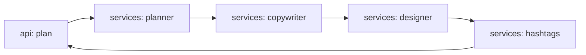

# agent-instagram-crew

[](https://github.com/Shamanchi/agent-instagram-crew/actions/workflows/ci.yml)
[](https://www.python.org/)
[](./Dockerfile)
[](./LICENSE)

> **English TL;DR:** FastAPI Instagram content crew: planner picks pillars, copywriter drafts captions with CTA, designer writes the visual brief, hashtag set assembled from the topic. Fully offline with deterministic templates.

Контент-команда для Instagram: планировщик выбирает рубрики, копирайтер пишет подписи с CTA, дизайнер — визуальный бриф, хэштеги собираются из темы. Шаблоны детерминированы, офлайн.

Источник темы: `Hands-On-AI-Engineering / P-128 (instagram_post_crew)` — идею и постановку взяли из каталога, код и тексты написаны с нуля.

## Какую задачу решает

Нужен контент-план на неделю без креативной команды: агент берёт тему и тон, распределяет посты по рубрикам, пишет подписи с призывом и визуальные брифы для дизайнера.

## Архитектура



Слои: `api/` → `services/` → `core/`, настройки через `pydantic-settings`.

## Быстрый старт

```bash
cp .env.example .env
pip install -r requirements.txt
uvicorn app.main:app --reload
curl -X POST http://127.0.0.1:8000/api/v1/plan -H "Content-Type: application/json" -d "{\"topic\": \"morning coffee\", \"posts\": 3, \"tone\": \"friendly\"}"
```

Docker:

```bash
docker compose up --build
```

## API

- `GET /api/v1/health` — проверка сервиса.
- `POST /api/v1/plan` — контент-план. Тело: `{"topic": "morning coffee", "posts": 3, "tone": "friendly"}`. Ответ: `posts` (pillar, caption, cta, visual_brief, hashtags).

Пример ответа `plan` (сокращённо):

```json
{
  "topic": "morning coffee",
  "posts": [{"pillar": "education", "caption": "...", "cta": "Save this post", "visual_brief": "...", "hashtags": ["#morning", "#coffee"]}]
}
```

## Переменные окружения (.env)

| Переменная | Назначение | По умолчанию |
|---|---|---|
| `MAX_POSTS` | Макс. постов в плане | `7` |
| `BRAND_TAG` | Фирменный хэштег в каждом наборе | `#dailybrew` |
| `APP_HOST` / `APP_PORT` | Хост/порт API | `0.0.0.0` / `8000` |

Полный список — в [.env.example](./.env.example).

## Тесты

```bash
pip install -r requirements.txt
pytest -q
pytest -q -m integration
```

Unit-тесты без сети. Интеграционные (`-m integration`) — через TestClient, тоже без сети.

## Контакты

- Telegram: @PavelYrevichh
- Email: Lietman46@mail.ru
- GitHub: Shamanchi
- FL.ru: https://www.fl.ru/users/Shamanchi
